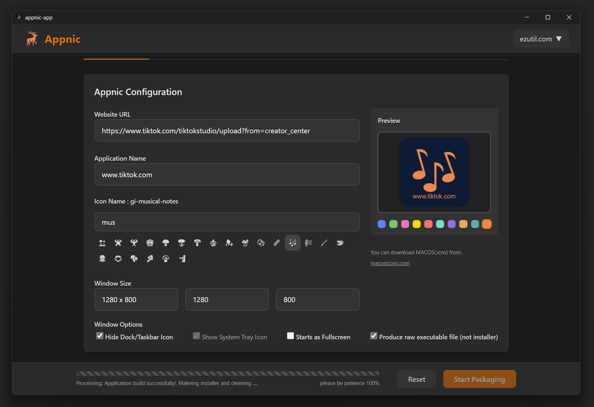
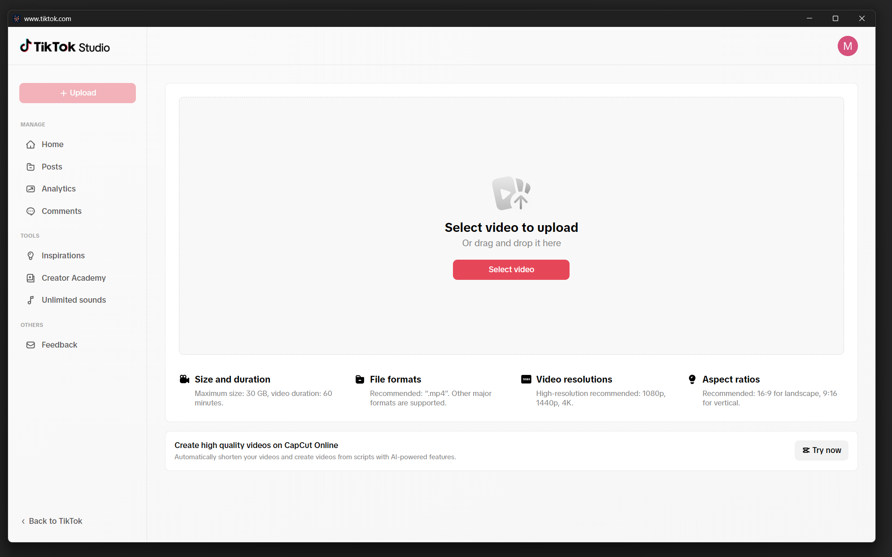
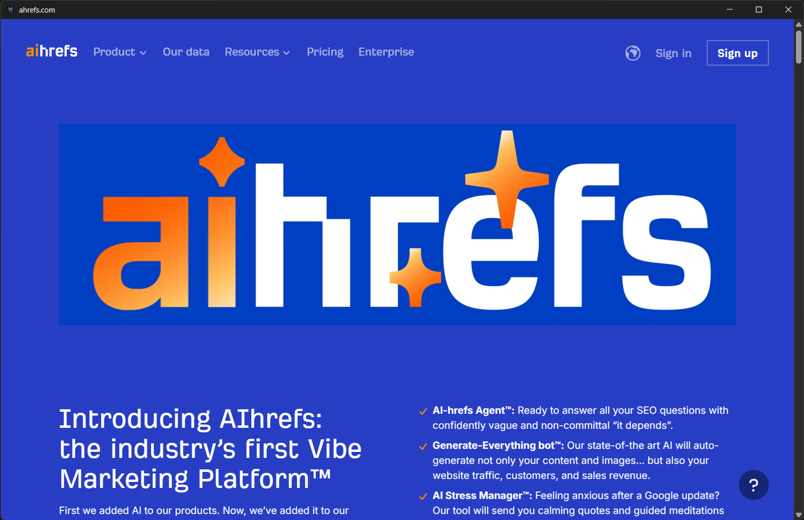

# Appnic - Web to Desktop App Wrapper

- Transform any website into a desktop application with customizable settings for Windows and macOS.
- You can place any commonly used pages into the system tray for quick access, whether you are using macOS or Windows

## Screenshots

 <!-- Replace with actual screenshot URL -->
*Appnic's simple and intuitive interface*

 <!-- Replace with actual screenshot URL -->
*Example of a wrapped web app running as a desktop application*

 <!-- Replace with actual screenshot URL -->
*Example of a wrapped adhref app running as a desktop application*

## Features

### Core Features
- 🖥️ **URL to App** - Convert any web URL into a standalone desktop application
- � **Customizable Window** - Choose between windowed or full-screen mode
- ️⚙️ **Background Options** - Configure whether the app runs in background
- 📌 **Taskbar/Dock Control** - Show or hide application from taskbar/dock
- 🆓 **Completely Free** - All preview versions are free with no limitations

### For Enterprise
- 🏢 **Enterprise Distribution** - Generate native `*.dmg` (macOS) or `*-setup.exe` (Windows) packages
- 🔒 **Internal Tools** - Quickly deploy web-based internal tools as desktop apps
- 🚀 **Rapid Prototyping** - Create demo versions of future native applications, If there exists a webapp, you don't need to develop a desktop version.
- 📦 **Custom Packaging** - Bundle web apps with enterprise branding

### Specialized Use Cases
- 🎮 **Gamer Friendly** - Turn browser games into dedicated apps
- 👨‍💻 **Developer Ready** - Wrap documentation and dashboards
- 📱 **Social Media** - Manage platforms as native applications

## Download

Latest version: **v0.1.0-preview** <!-- Update version number -->

| Platform | Arch Support |
|----------|---------------|
| Windows  | x86_64 |
| macOS    | aarch64, x86_64 |

## Installation

### Windows
1. Download the `.exe` installer
2. Run the installer and follow the prompts
3. Launch Appnic from your Start Menu

### macOS
1. Download the `.dmg` file
2. Open the disk image and drag Appnic to your Applications folder
3. Launch from Spotlight or your Applications folder

## How to Use

1. Launch Appnic
2. Enter the URL you want to wrap
3. Configure your preferences:
   - Window mode (Windowed/Fullscreen)
   - Background behavior
   - Taskbar/Dock visibility
4. Click "Create App"
5. Your new desktop app will compiled and be available for future use

## Use Cases

### For Gamers
- Wrap your favorite browser games as dedicated apps
- Avoid digging through browser bookmarks
- Keep games running without maintaining browser windows

### For Developers
- Transform documentation sites (Cloudflare, AWS, etc.) into desktop apps
- Wrap web tools (Gmail, analytics dashboards) for professional workflow
- Create quick-access developer resources

### For Everyone
- Turn important websites (blogs, admin panels) into easily accessible apps
- Manage social media (Tiktok uploads) as native applications
- Improve productivity by reducing browser tab clutter

### Fullscreen shortcuts

- windows fullscreen switch shortcut : `alt + enter`
- macos fullscreen switch shortcut : `opt + enter`

## Roadmap

- [ ] Add Linux support
- [ ] Add Windows aarch64 support
- [ ] Custom icon support for wrapped apps
- [ ] Keyboard shortcut customization

## Support

Having issues? Please [file an issue](https://github.com/tech-ezutil/appnic/issues) on our GitHub repository.

